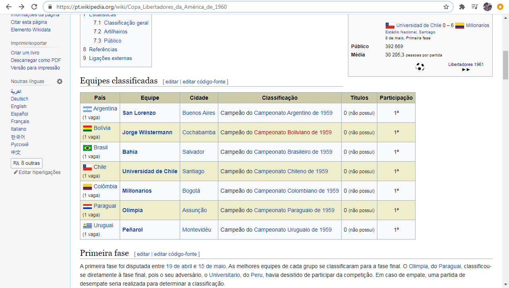

```{r setup, include=FALSE}
knitr::opts_chunk$set(echo = TRUE)
```

Para começar, são necessários três pacotes: rvest e httr para extrair os dados da web, e tidyverse para manipular os dados, uma vez que eles já estão em nosso workspace.

```{r, message=FALSE}
library(tidyverse)
library(rvest)
library(httr)
```

- Extraindo os dados para a primeira edição do torneio

Os dados sobre os times classificados para a libertadores no ano de 1960 estão na url https://pt.wikipedia.org/wiki/Copa_Libertadores_da_Am%C3%A9rica_de_1960.

{width=80%}

Ao clicar com o botão direito do mouse e selecionar a opção Inspecionar, o XPath da tabela é dado por //*[@id="mw-content-text"]/div[1]/table[2]

{width=80%}

Com essas informações, importamos a tabela com o comando abaixo.

```{r}
url = ('https://pt.wikipedia.org/wiki/Copa_Libertadores_da_Am%C3%A9rica_de_1960')

resultado = url %>%
  read_html() %>%
  html_nodes(xpath = '//*[@id="mw-content-text"]/div[1]/table[2]') %>% 
  html_table()
```

O valor que é armazenado na variável resultado é uma lista com um elemento, onde esse elemento é a tabela.

```{r}
resultado[[1]][,1:3] # exibindo as 3 primeiras colunas
```

Para o objetivo desse projeto, só as colunas País e Equipe são necessárias. Logo, selecionamos essas duas colunas e armazenamos no objeto tabela. Por simplicidade, os nomes das colunas ficarão com todas as letras em minúsculo e sem acentuação. Além disso, adicionamos uma coluna referente ao ano em que ocorreu o torneio. Isso é importante, pois quando unirmos as tabelas de todas as edições do torneio, queremos saber qual foi o ano em que determinado clube se classificou para a libertadores.

```{r}
tabela = resultado[[1]] %>% select(País, Equipe)
colnames(tabela) = c("pais", "equipe")
no_equipes = nrow(tabela) # número de equipes classificadas
edicao = rep(1960, no_equipes)
tabela = cbind(edicao, tabela) # adicionando a coluna edicao
```

Ao contruir os gráficos, é conveniente que os valores na coluna pais estejam sem os parenteses e a informação contida nos parenteses, ou seja, só o nome do país.
Uma solução, retirada do stackoverflow, é a seguinte:

```{r}
tabela$pais = gsub("\\s*\\([^\\)]+\\)","",as.character(tabela$pais))
tabela
```

A tarefa agora é extrair as tabelas para todas as edições do torneio e deixar no formato acima.

Seria interessante podermos generalizar o algoritmo acima para extrair a tabela dos outros anos. No entanto, não seria produtivo analisar as páginas do Wikipedia para cada ano manualmente a fim de encontrar um padrão entre elas, pois temos mais de 40 páginas. Temos que encontrar uma maneira sistemática de fazer isso. Como usamos apenas duas informações para importar a tabela, url da página e XPath da tabela, precisamos encontrar uma forma de generalizar nosso código a partir desses dois elementos.

- Analise da url

Vamos usar a página do torneio no ano de 2020 para comparar com a página do ano de 1960.

1960: https://pt.wikipedia.org/wiki/Copa_Libertadores_da_Am%C3%A9rica_de_1960

2020: https://pt.wikipedia.org/wiki/Copa_Libertadores_da_Am%C3%A9rica_de_2020

Comparando as duas urls, o que difere são os 4 últimos dígitos, ao qual se referem ao ano em questão. Logo, supomos que a url para acessar a página do torneio de qualquer ano é https://pt.wikipedia.org/wiki/Copa_Libertadores_da_Am%C3%A9rica_de_xxxx, onde xxxx é substituído pelo ano que queremos analisar.

Com isso, vamos verificar se conseguimos conectar com as url's de cada ano. O código abaixo faz essa tarefa.

```{r}
for (ano in 1960:2020) {
    url = paste0('https://pt.wikipedia.org/wiki/Copa_Libertadores_da_Am%C3%A9rica_de_', ano)
    url %>% read_html()
}
```

O código não retornou nenhum erro, o que indica que todas as url's são válidas.
